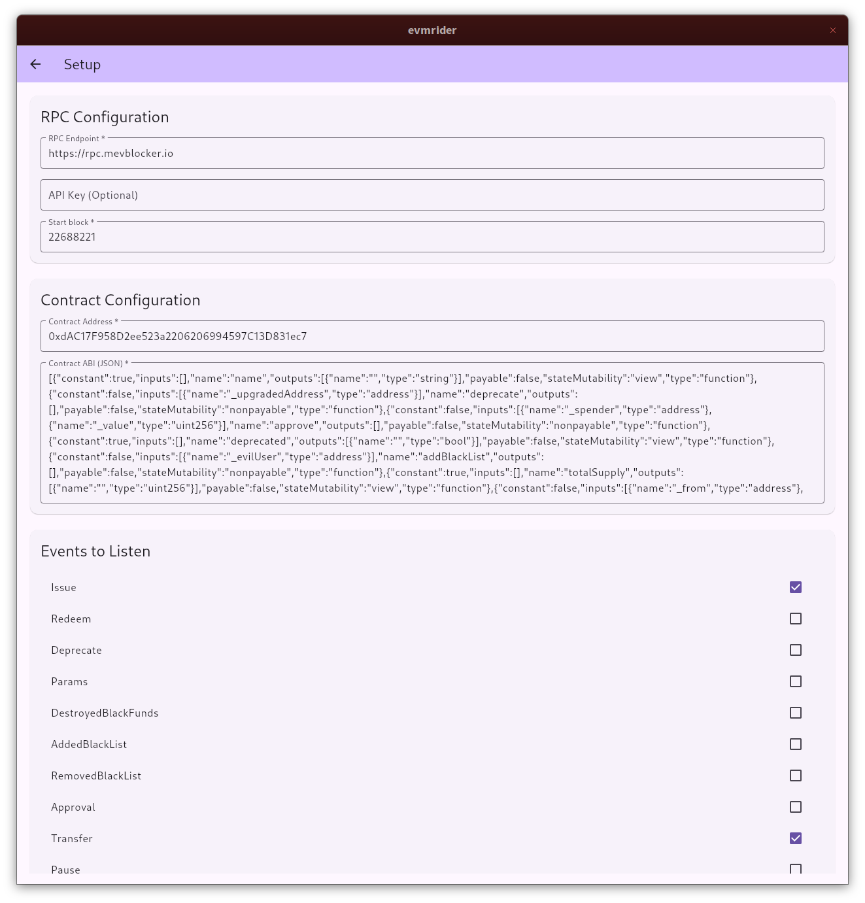

# evmrider

A simple EVM event listener made with Flutter.

## Setup

You can find a bunch of free RPC endpoints here: https://chainlist.org/chain/1

Easiest way to get the contract ABI is through etherscan.

For example, https://etherscan.io/token/0x044d078F1c86508e13328842Cc75AC021B272958#code and scroll down to Contract ABI and click copy in the upper right.

## Flatpak

Build requirements: Flutter, Flatpak, and Flatpak Builder.

Build a bundle:

```bash
./build_flatpak.sh
```

Run the bundle:

```bash
flatpak install --user build/evmrider.flatpak
flatpak run com.peerchemist.evmrider
```

## Screenshots



